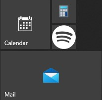
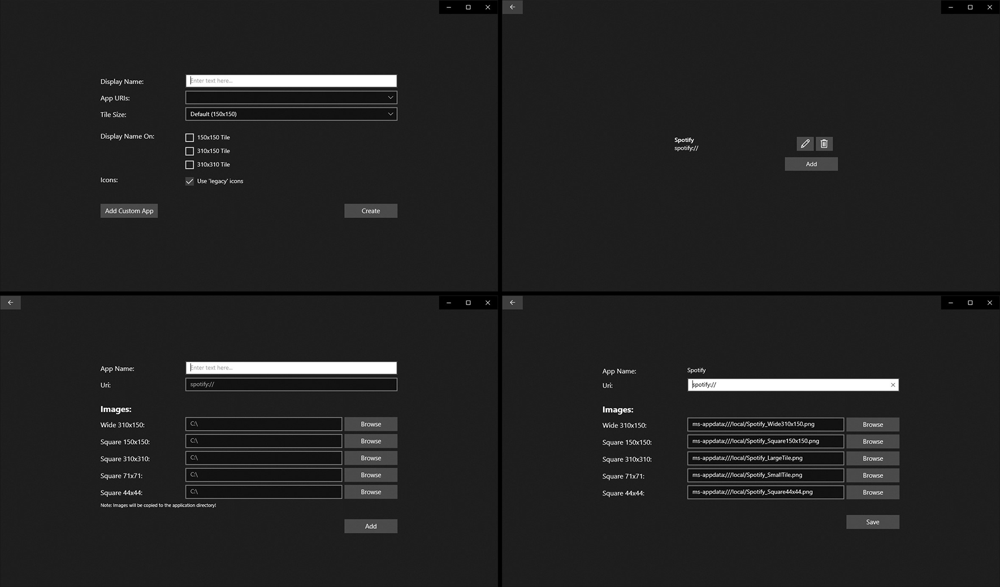

# let-me-use-my-accent-colors

Because Microsoft made it's apps ignore the accent color and ruined my start menu, I've written this little uwp app to create custom "shortcuts" for certain uwp apps.

